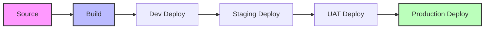

# 🚀 AWS CI/CD Pipeline Status

> **Real-time pipeline monitoring for `aws-badges-test-pipeline`**
> 
> This dashboard provides a live, visual representation of the current state of our deployment pipeline across all environments.

### 📉 Visual Flow

### 📊 Pipeline Flow

| Stage | Activity | Current Status | Last Updated | 🔑 Commit | 👤 Triggered By |
| :--- | :--- | :--- | :--- | :--- | :--- |
| **01. Source** | Repository Listeners |  |  |  |  |
| **02. Build** | Artifact Compilation |  |  |  |  |
| **03. Dev** | Development Deploy |  |  |  |  |
| **04. Staging** | Staging Deploy |  |  |  |  |
| **05. UAT** | User Acceptance |  |  |  |  |
| **06. Production** | Live Environment |  |  |  |  |

---

### 🛡️ Deployment Security & Logs
*   **Artifact Store**: Private S3 with CloudFront OAC.
*   **Cache Strategy**: Native Camo Purge (Live Image Updates).
*   **Infrastructure**: AWS Lambda + CloudWatch Events.

========

graph LR
    S((Source)) --> B(Build) --> D(Dev) --> ST(Staging) --> U(UAT) --> P((Production))
    
    style S fill:#f3f4f6,stroke:#333
    style P fill:#f3f4f6,stroke:#333

---
*Status badges are updated automatically on every pipeline state change.*
